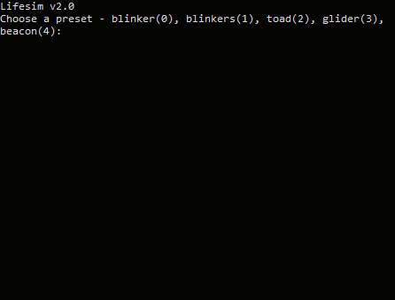

## Lifesim v2.0
Lifesim v2.0 is a simple shell based life simulation in a 2D grid with only 2 states - alive or dead.

The current version has 5 presets, 3 of which are oscilating with period of 2,
one dies out eventually and the remaining is a moving wing.

Toad preset

Blinkers preset

